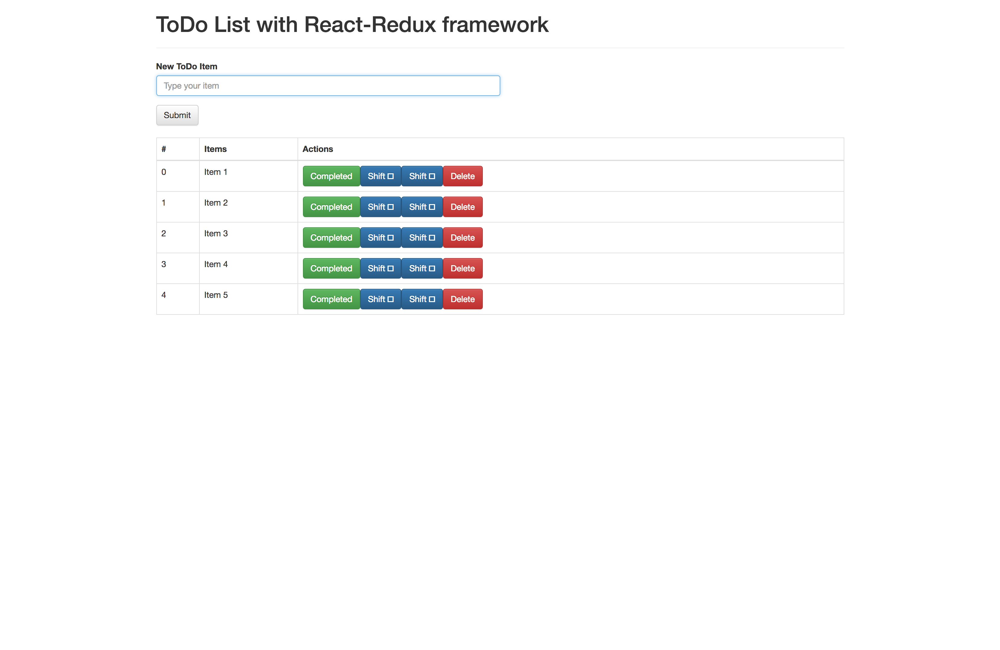

# ToDo list using React Redux
A simple todo list built on Reactjs, Redux, Webpack, Scss.

To install dependencies just do 
After cloning,

$ cd todo-redux

$ npm install

and start local development server (available at https://localhost:8080/):

$ npm run dev

<h3>Todo List using React-Redux</h3>

